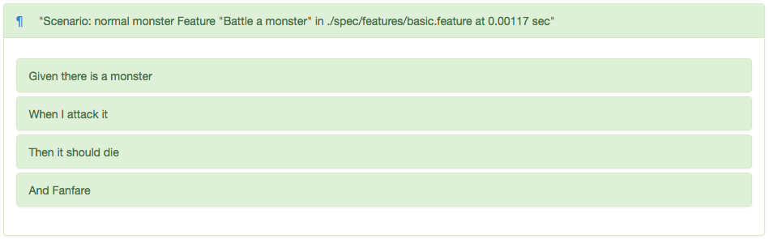
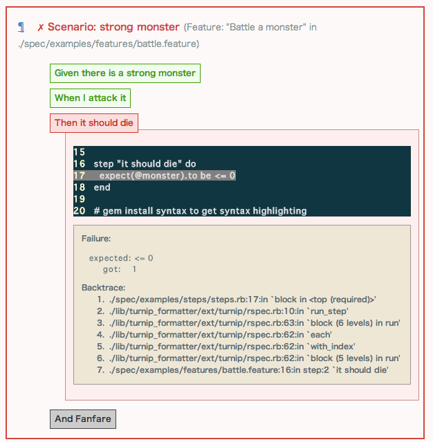
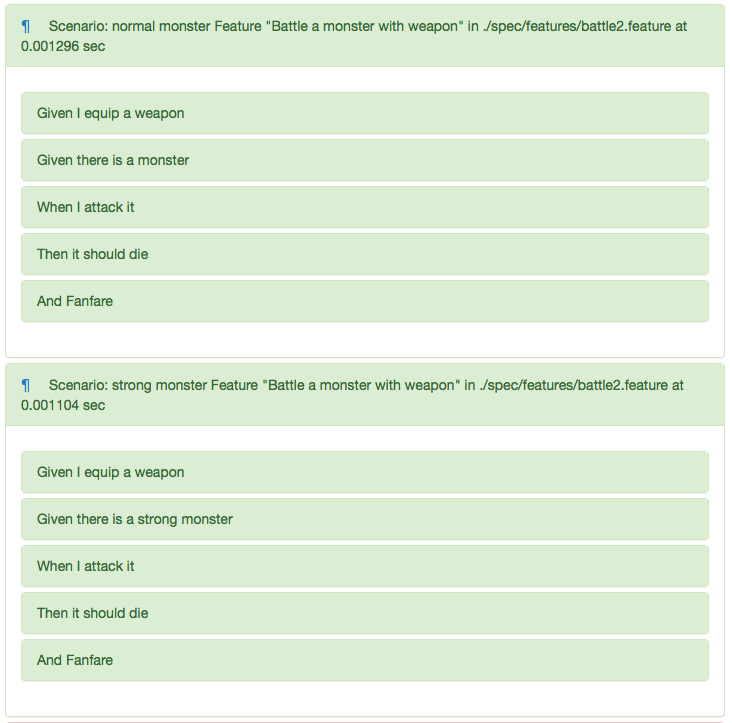
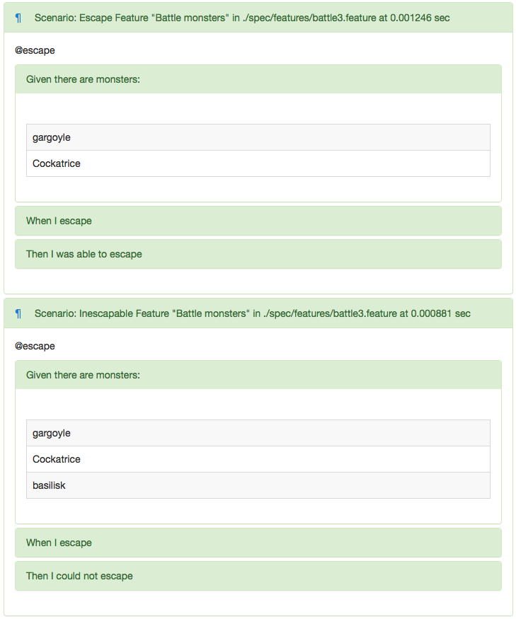
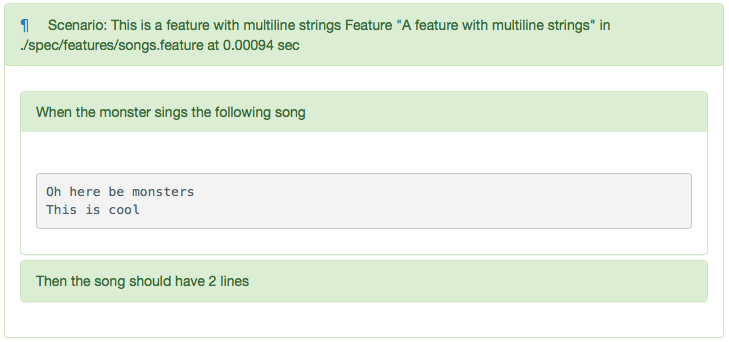

# TurnipFormatter Demo

## Usage

    $ cd /path/to/turnip_formatter
    $ bundle install --path vendor/bundle
    $ cd example
    $ bundle exec rspec
    $ open report.html

## Screenshot

### Basic step

```feature
Scenario: normal monster
  Given there is a monster
   When I attack it
   Then it should die
    And Fanfare
```



### Failed step

```feature
Scenario: strong monster

  This scenario will error
  So, fanfare is not...oh...

  Given there is a strong monster
   When I attack it
   Then it should die
    And Fanfare
```



### Pending step and specify tag

```feature
  Scenario: spell magic

    This scenario will error because he can't cast spell

    Given there is a strong monster
     When I cast a spell 'fireball'
      And I attack it
     Then it should die
      And Fanfare

  @magician
  Scenario: spell magic 

    Given there is a strong monster
     When I cast a spell 'fireball'
      And I attack it
     Then it should die
      And Fanfare
```


### Background

```feature
Feature: Battle a monster with weapon

  Background:
    Given I equip a weapon

  Scenario: normal monster
    Given there is a monster
     When I attack it
     Then it should die
      And Fanfare

  Scenario: strong monster
    Given there is a strong monster
     When I attack it
     Then it should die
      And Fanfare
```



### Outline

```feature
Feature: Battle monsters

  Scenario: Escape
    Given there are monsters:
      | gargoyle   |
      | Cockatrice |
     When I escape
     Then I was able to escape

  Scenario: Inescapable
    Given there are monsters:
      | gargoyle   |
      | Cockatrice |
      | basilisk   |
     When I escape
     Then I could not escape
```



### Multiline

```feature
Feature: A feature with multiline strings
  Scenario: This is a feature with multiline strings
    When the monster sings the following song
    """
    Oh here be monsters
    This is cool
    """
    Then the song should have 2 lines
```


