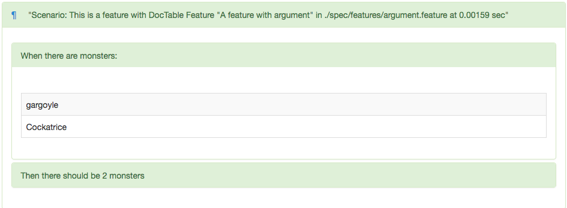
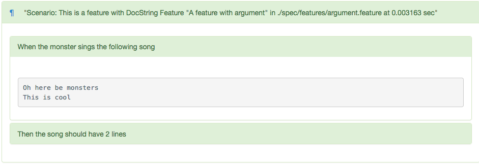
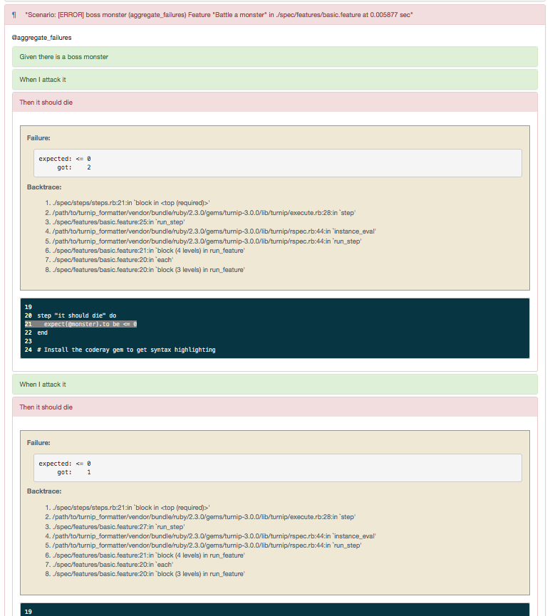
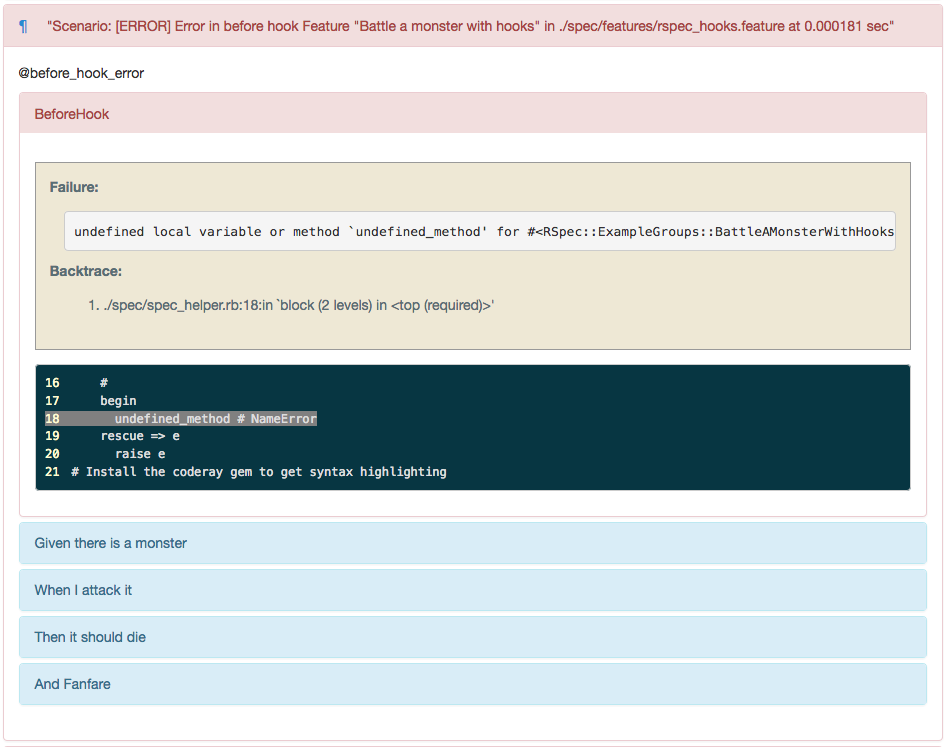
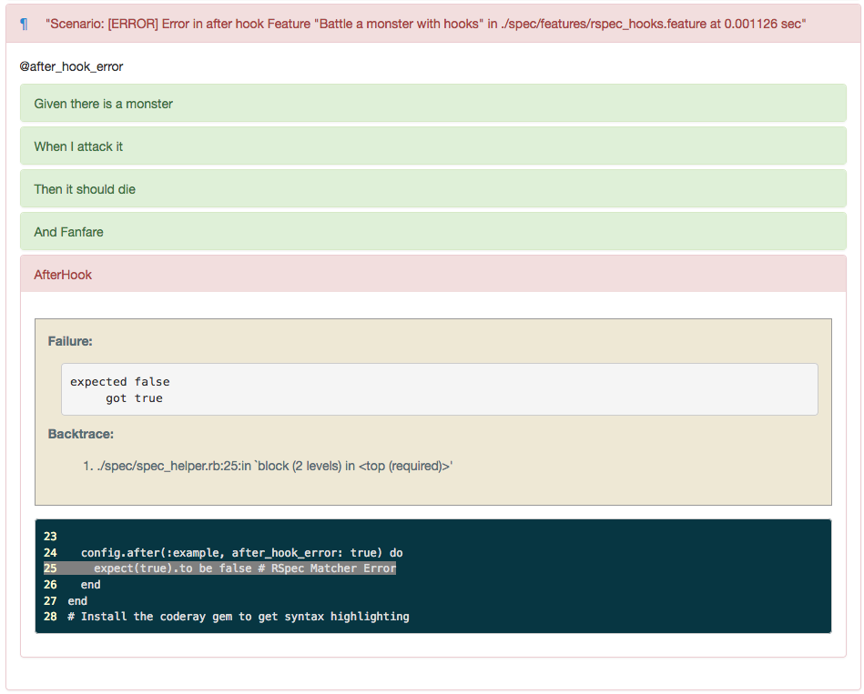

TurnipFormatter Demo
==================================================

Usage
------------------------------

    $ cd /path/to/turnip_formatter
    $ bundle install --path vendor/bundle
    $ cd example
    $ bundle exec rspec
    $ open report.html

Screenshot
------------------------------

### Basic

```feature
Scenario: normal monster
  Given there is a monster
   When I attack it
   Then it should die
    And Fanfare
```


### Failed scenario

```feature
Scenario: [ERROR] strong monster

  This scenario will not success because his attacks can't defeat strong monster

  Given there is a strong monster
   When I attack it
   Then it should die
    And Fanfare
```


### Pending scenario

```feature
Scenario: [PENDING] spell magic

  This scenario will not success because he can't cast spell

  Given there is a strong monster
   When I cast a spell 'fireball'
    And I attack it
   Then it should die
    And Fanfare
```


### Background

```feature
Background:
  Given I equip a weapon

Scenario: normal monster
  Given there is a monster
   When I attack it
   Then it should die
    And Fanfare

Scenario: strong monster

  His attacks can defeat strong monster if has weapon.

  Given there is a strong monster
   When I attack it
   Then it should die
    And Fanfare
```


### Data table (outline)

```feature
Scenario: This is a feature with DocTable
  When there are monsters:
    | gargoyle   |
    | Cockatrice |
  Then there should be 2 monsters
```



### Doc string (multiline)

```feature
Scenario: This is a feature with DocString
  When the monster sings the following song
  """
  Oh here be monsters
  This is cool
  """
  Then the song should have 2 lines
```



### Other failure pattern

Use `aggregate_failures`:

```feature
@aggregate_failures
Scenario: [ERROR] boss monster (aggregate_failures)

  Even if error occurs during steps, test will run to the end

  Given there is a boss monster
   When I attack it
   Then it should die
   When I attack it
   Then it should die
   When I attack it
   Then it should die
    And Fanfare
```




Occur error before and after hook:

```ruby
RSpec.configure do |config|
  config.before(:example, before_hook_error: true) do
    undefined_method # NameError
  end

  config.after(:example, after_hook_error: true) do
    expect(true).to be false # RSpec Matcher Error
  end
end
```

```feature
@before_hook_error
Scenario: [ERROR] Error in before hook
  Given there is a monster
   When I attack it
   Then it should die
    And Fanfare

@after_hook_error
Scenario: [ERROR] Error in after hook
  Given there is a monster
   When I attack it
   Then it should die
    And Fanfare
```




